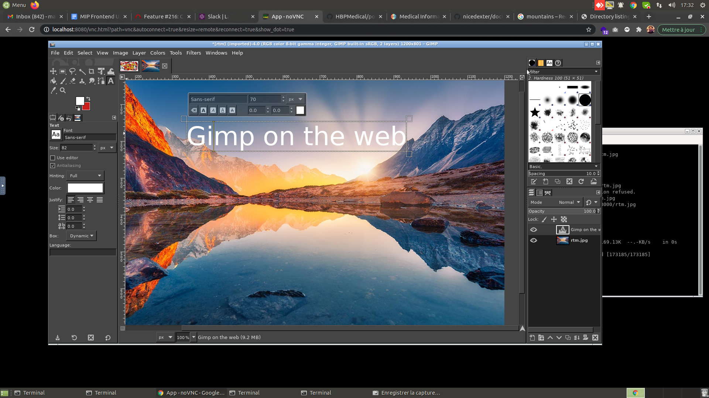

# Docker GUI Application POC

## build & run

```
cd app
./build.sh
```
## app
http://127.0.0.1:8080
user/password

Right click gives you access to a terminal

## files
http://127.0.0.1:8080/files/

## webdav
http://127.0.0.1:8080/webdav/




## Source
[howto on digitalocean](https://www.digitalocean.com/community/tutorials/how-to-remotely-access-gui-applications-using-docker-and-caddy-on-ubuntu-20-04)


